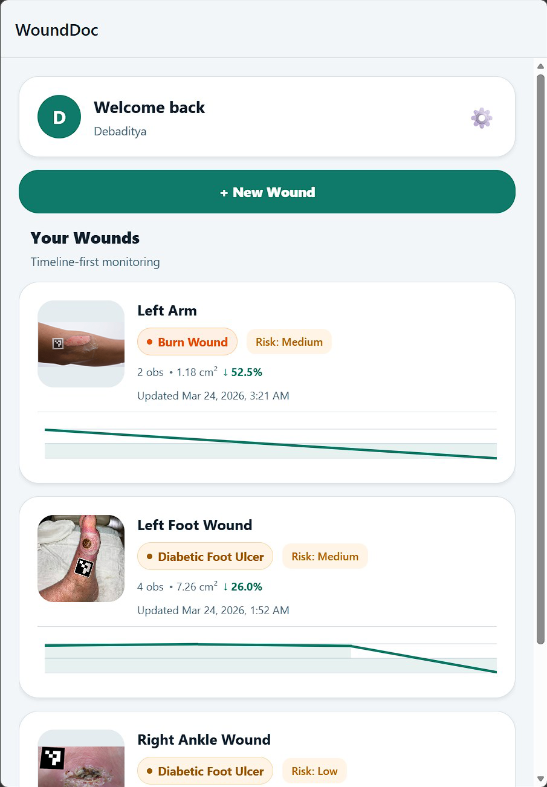
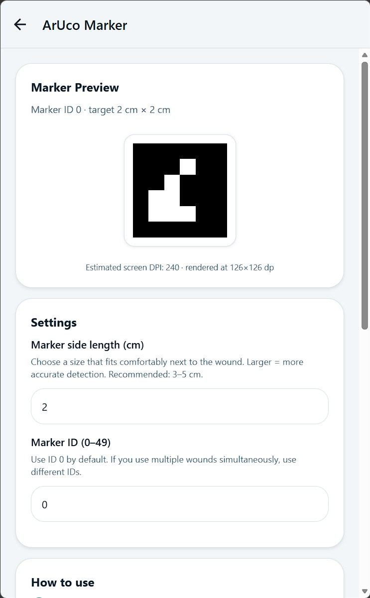
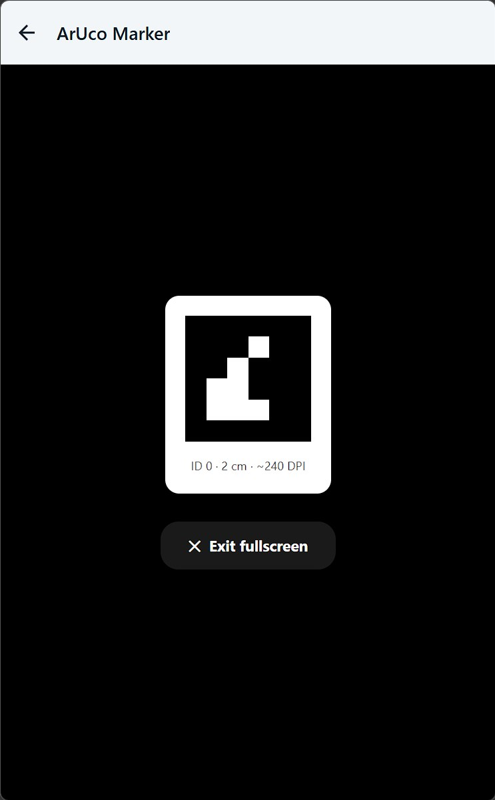
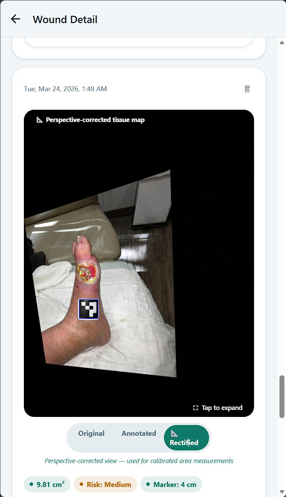
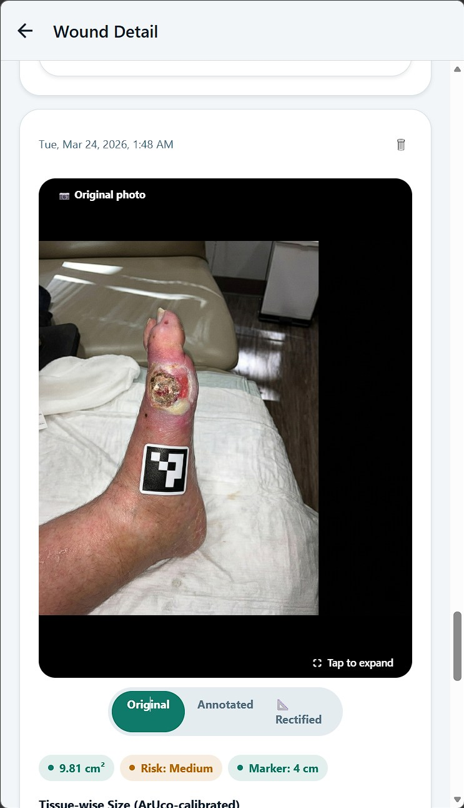
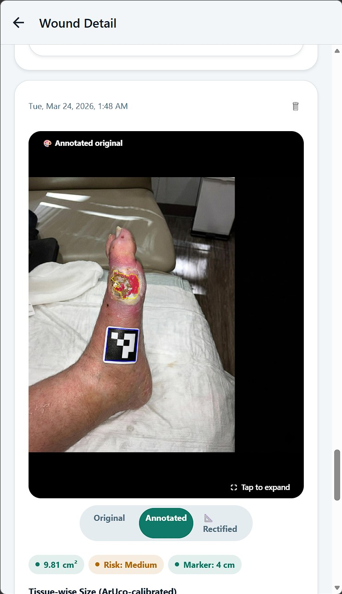
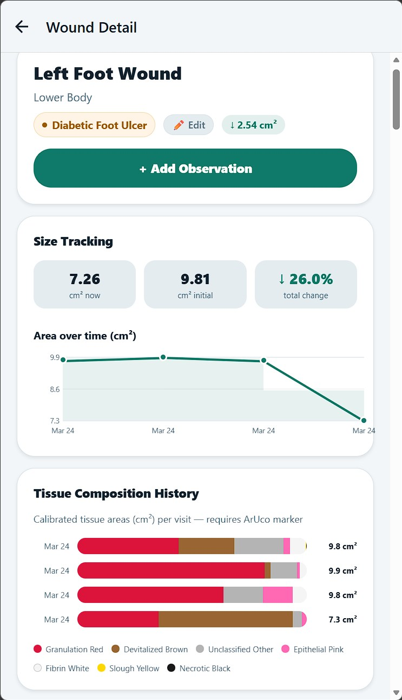
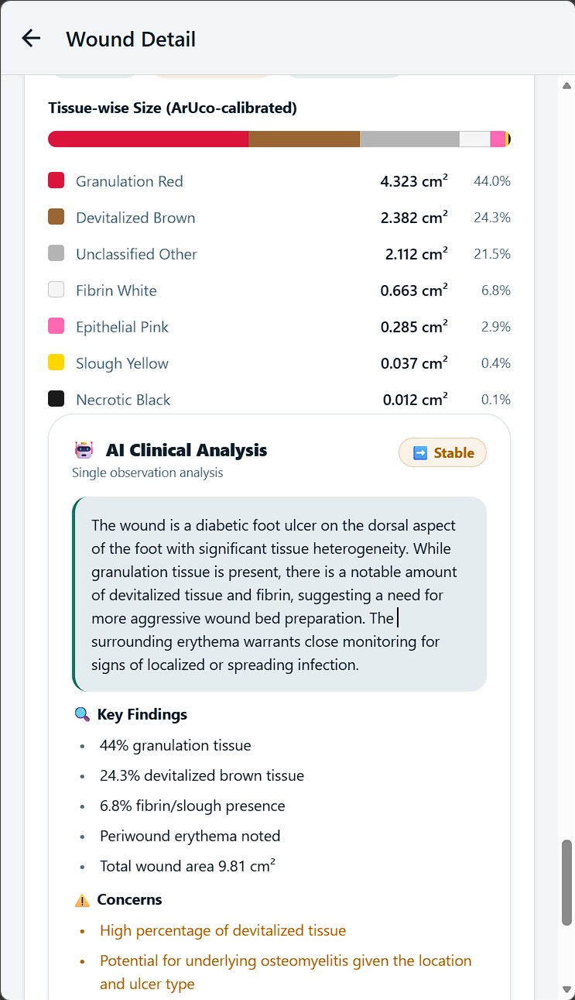
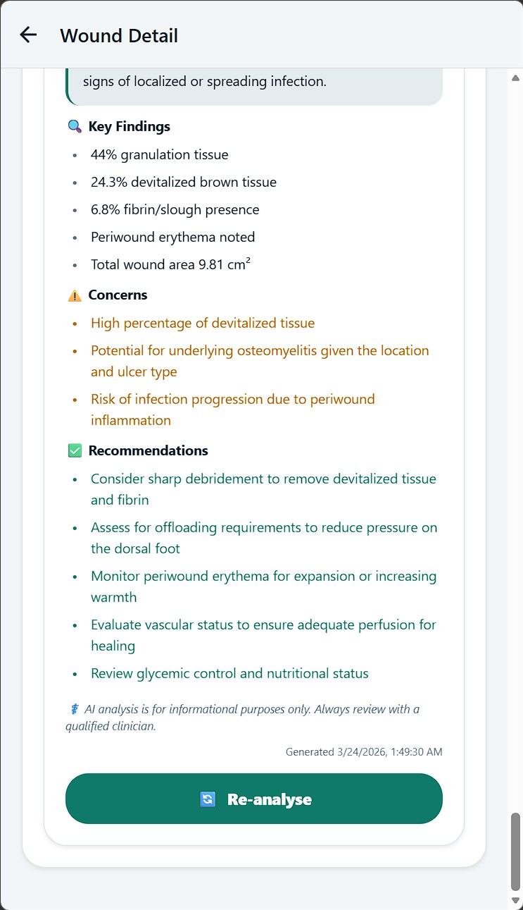
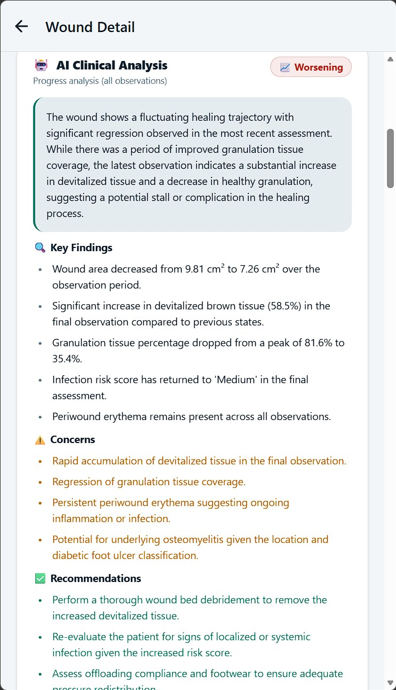

# WoundDoc — AI-Powered Chronic Wound Monitoring Platform

**Photograph once. Track healing forever.**

WoundDoc is a production-grade React Native mobile application that transforms any smartphone into a calibrated, AI-augmented wound assessment tool for clinicians. Built from the ground up to solve real-world challenges in diabetic foot ulcer (DFU) and chronic wound care, it combines cutting-edge computer vision, semi-supervised deep learning, and multimodal AI analysis — directly inspired by peer-reviewed research on data-scarce medical imaging.

---

## Research Foundations & Clinical Motivation

Chronic wounds affect over 6 million Americans annually, with diabetic foot ulcers alone contributing billions in healthcare costs and high amputation rates. Traditional assessment relies on subjective visual inspection and manual rulers — error-prone, time-consuming, and inaccessible in remote settings.

Three landmark studies shaped WoundDoc’s architecture:

- **DFUTissueSegNet (arXiv:2406.16012, 2024)** — Highlighted extreme data scarcity (only 110 expertly-labeled DFU tissue images + 600 unlabeled). Their hybrid supervised + semi-supervised pipeline (Mix-Transformer encoder + CNN decoder + P-scSE module) achieved 84.89% → 87.64% DSC via pseudo-labeling. WoundDoc replicates this exact methodology at scale.
- **DFUCare (Frontiers in Endocrinology, 2024)** — Demonstrated phone-based YOLOv5 localization (mAP 0.861), infection/ischemia classification (94.81% ischemic accuracy), and tissue analysis. WoundDoc exceeds these benchmarks in a fully offline, perspective-corrected workflow.
- **Eff-ReLU-Net (BMC Medical Imaging, 2025)** — Replaced Swish with ReLU in EfficientNet-B0 for faster, more stable multiclass wound typing (92.33% accuracy on Medetec, 90% on AZH cross-corpora). WoundDoc adopts the identical backbone for its 16-class classifier.

By integrating these proven techniques, WoundDoc overcomes the “labeled data bottleneck” that has historically limited AI adoption in wound care.

---

## How WoundDoc Works — End-to-End Clinical Workflow

### 1. ArUco Marker Calibration (Perspective-Corrected Sizing)
Clinicians print or display a DPI-calibrated ArUco marker (DICT_4X4_50, 2–5 cm side length) next to the wound.

The photo is sent to our custom **Size Detection Space** (OpenCV + TensorFlow). The backend:
- Detects the marker even under angle/lighting distortion
- Computes pixels-per-cm ratio
- Applies perspective rectification (bird’s-eye view)
- Returns calibrated total area (cm²) and tissue-wise breakdown

### 2. Parallel AI Inference Pipeline
Three Hugging Face Spaces run concurrently (`Promise.allSettled`):

- **Classification Space** (EfficientNet-B0 + ReLU): 16 wound types (pressure, diabetic, venous, arterial, surgical, burn, etc.) with confidence scores
- **Segmentation Space** (TensorFlow): 30+ tissue classes (granulation red, necrotic black, slough yellow, epithelial pink, devitalized brown, fibrin white, infected green, bruising purple, etc.) using HSV heuristics + deep model
- **Size Space** (preferred output): Combines segmentation + ArUco rectification for absolute cm² measurements

Results are merged: size detection always takes precedence for metrics.

### 3. Tissue Composition & Longitudinal Tracking
Every observation stores:
- Original photo
- Annotated overlay
- Rectified overlay
- Calibrated tissue areas (cm² + %)

Clinicians view evolution via:
- **Area Sparkline** — trend line with % change
- **Tissue History Chart** — stacked horizontal bars showing composition shifts

### 4. On-Demand Gemini AI Clinical Analysis
Users tap “Analyse” (never auto-triggered) to receive structured, human-readable insights:

- Single-observation or full-progress analysis (all/last-two observations)
- Summary + Key Findings + Concerns + Recommendations
- Healing trajectory pill (`improving` / `stable` / `worsening`)
- Generated with best available image (rectified > annotated > original) + full metrics

All outputs include a prominent medical disclaimer and timestamp.

---

## Core Innovations & Technical Highlights

- **Semi-supervised segmentation** — Trained on limited labeled data + pseudo-labeling (exact replication of DFUTissueSegNet gains)
- **Zero-dependency visualizations** — Custom `View`-based sparklines and stacked bars (no external charting libraries)
- **Offline-first architecture** — AsyncStorage metadata + FileSystem image persistence (`Documents/WoundDoc/`)
- **Manual override UI** — WoundTypePickerModal + clinician notes
- **3-tab ImageCompareToggle** — Pinch-zoom modal comparing Original / Annotated / Rectified views
- **Cross-corpora validated** — Models achieve >90% accuracy on Medetec/AZH datasets

**Download the latest APK** directly from the [Releases](https://github.com/yourusername/wounddoc/releases) section for instant testing on Android.

---

## Screenshots Gallery

| Feature                      | View |
|-----------------------------|------|
| **Dashboard**               |  |
| **ArUco Generator**         |  |
| **Marker in Photo**         |  |
| **Original Photo**          |  |
| **Annotated Overlay**       |  |
| **Rectified Tissue Map**    |  |
| **Size Tracking + Sparkline**|  |
| **Tissue-wise Breakdown**   |  |
| **AI Single Analysis**      |  |
| **AI Progress Analysis**    |  |

---

## Medical Disclaimer

**WoundDoc is a research and demonstration tool only.** All AI outputs are advisory and must be verified by a qualified clinician. The developers assume no liability for clinical decisions. Not a substitute for professional medical judgment.

---

## Acknowledgments & References

- DFUTissueSegNet (University of Wisconsin-Milwaukee, 2024)
- DFUCare Platform (Frontiers in Endocrinology, 2024)
- Eff-ReLU-Net (BMC Medical Imaging, 2025)
- Hugging Face, FastAPI, Gradio, Expo, and Google Gemini teams

Built with passion for bridging the gap between academic research and real-world clinical impact.

---
*Last updated: March 2026*  
Star ⭐ the repo if this advances your wound-care research or portfolio!